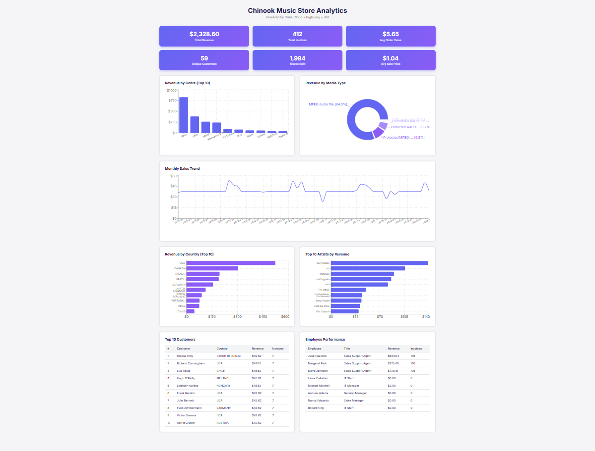

# Chinook Data Platform

An end-to-end modern data stack project that implements a complete ELT pipeline for the Chinook digital music store. Data flows from raw CSV files through **Google BigQuery**, is transformed via a three-layer **dbt** project into a star schema, orchestrated by **Apache Airflow**, served through a **Cube.js** semantic layer on **Cube Cloud**, and visualized in a custom **React** dashboard.

## Dashboard Preview



## Architecture

<p align="center">
  
</p>

## Airflow DAGs

The pipeline uses two DAGs connected via **Airflow Datasets** (event-driven scheduling):

- **`local_csvs_to_bigquery`** — Creates the BigQuery dataset and loads 11 CSV files in parallel. Each task declares a Dataset outlet to trigger the downstream dbt DAG.
- **`chinook_dbt_build`** — Triggered automatically after ingestion completes. Runs dbt deps, build (with `--fail-fast`), and test sequentially.

<p align="center">
  
</p>

## Tech Stack

| Layer           | Technology                        | Version          |
|-----------------|-----------------------------------|------------------|
| Warehouse       | Google BigQuery                   | -                |
| Transformation  | dbt-core + dbt-bigquery           | 1.7.7            |
| Orchestration   | Apache Airflow (CeleryExecutor)   | 3.0.0            |
| Semantic Layer  | Cube.js (Cube Cloud)              | v1.3.14          |
| Dashboard       | React + Recharts                  | React 19 + Vite 7|
| CI/CD           | GitHub Actions                    | -                |
| Infrastructure  | Docker Compose                    | -                |
| Language        | Python, SQL, JavaScript           | Python 3.11+     |

## Project Structure

```
chinook-datapipeline/
├── airflow/                         # Orchestration
│   ├── dags/
│   │   ├── local_csvs_to_bq.py         # CSV → BigQuery ingestion
│   │   └── dbt_run_dag.py              # dbt build (Dataset-triggered)
│   ├── Dockerfile                       # Custom Airflow image with dbt
│   ├── docker-compose.yaml              # 10 services (Celery, Redis, Postgres)
│   └── .env.example
│
├── dbt/chinook_data_platform/       # Transformation
│   ├── models/
│   │   ├── staging/                     # 11 views — source cleaning & typing
│   │   ├── intermediate/                # 6 views — business aggregations
│   │   └── marts/                       # 11 tables — star schema
│   ├── tests/                           # 4 singular data quality tests
│   ├── dbt_project.yml
│   ├── packages.yml                     # dbt_utils 1.3.0
│   └── profiles.yml                     # BigQuery connection (dev/prod)
│
├── chinook-dashboard/               # Semantic Layer
│   └── model/
│       ├── cubes/                       # 11 cube definitions (YAML)
│       └── views/                       # sales_overview, customer_360
│
├── dashboard/                       # Frontend
│   ├── src/
│   │   ├── components/                  # 8 chart/table components
│   │   ├── cubejs-api.js                # Cube API client + custom hook
│   │   ├── App.jsx                      # Dashboard layout
│   │   └── App.css                      # Styling
│   └── package.json
│
├── data/                            # Source Data
│   ├── ChinookData.json                 # Original JSON source
│   ├── data-ingestion.py                # JSON → CSV converter
│   └── *.csv                            # 11 CSV files (git-ignored)
│
├── .github/workflows/ci.yml        # CI: dbt compile + YAML lint
├── requirements.txt                 # Python dependencies (pinned)
└── TECHNICAL_AUDIT_REPORT.md        # Detailed project audit
```

## Data Model

### Star Schema

The marts layer implements a dimensional model optimized for analytical queries:

**Fact Tables**
| Table | Grain | Description |
|-------|-------|-------------|
| `fact_sales` | Invoice line item | Line-level sales with all dimensional FKs |
| `fact_daily_sales` | Calendar day | Daily aggregated revenue, invoices, customers |

**Dimension Tables**
| Table | Description |
|-------|-------------|
| `dim_customers` | Customer profiles with lifetime value and order metrics |
| `dim_employees` | Employees with age, experience, and sales performance |
| `dim_tracks` | Tracks with denormalized album, artist, genre, media type |
| `dim_album` | Albums with artist info and sales aggregates |
| `dim_artists` | Artists with album count and revenue |
| `dim_genres` | Genres with sales metrics |
| `dim_media_types` | Media formats with sales metrics |
| `dim_date` | Calendar dimension (2005–2030) |
| `bridge_playlist_track` | Playlist–track many-to-many bridge |

### dbt Lineage

```
Sources (11 raw tables)
    ↓
Staging (11 views) — cleaning, casting, renaming
    ↓
Intermediate (6 views) — aggregations, business logic
    ↓
Marts (11 tables) — star schema for analytics
```

## Getting Started

### Prerequisites

- Google Cloud Platform account with BigQuery enabled
- GCP service account key with BigQuery Admin permissions
- Docker and Docker Compose
- Python 3.11+
- Node.js 18+ (for the dashboard)

### 1. Clone and Configure

```bash
git clone https://github.com/<your-username>/chinook-datapipeline.git
cd chinook-datapipeline

# Set up environment files
cp .env.example .env
cp airflow/.env.example airflow/.env
```

Edit both `.env` files with your GCP credentials:

```env
# airflow/.env
PROJECT_ID=your-gcp-project-id
DB_NAME=chinook_db
GCP_SA_KEY_PATH=/absolute/path/to/service-account.json
AIRFLOW__CORE__FERNET_KEY=<generate: python -c "from cryptography.fernet import Fernet; print(Fernet.generate_key().decode())">
DBT_BQ_PROJECT=your-gcp-project-id
DBT_BQ_KEYFILE=/keys/gcp-sa.json
```

### 2. Prepare Source Data

```bash
cd data
python data-ingestion.py
```

This converts `ChinookData.json` into 11 CSV files.

### 3. Start Airflow

```bash
cd airflow
docker compose up -d
```

Open Airflow UI at **http://localhost:8080** (default: `admin`/`airflow`).

### 4. Run the Pipeline

1. Trigger the **`local_csvs_to_bigquery`** DAG — loads CSVs into BigQuery
2. The **`chinook_dbt_build`** DAG triggers automatically via Dataset dependency
3. dbt runs: `deps → build → test`

### 5. Set Up Cube Cloud

1. Create a [Cube Cloud](https://cube.dev/cloud) account
2. Create a deployment connected to your GitHub repo
3. Set **Project Directory** to `chinook-dashboard`
4. Connect BigQuery with your service account credentials

### 6. Launch the Dashboard

```bash
cd dashboard
cp .env.example .env
# Edit .env with your Cube Cloud API URL and token
npm install
npm run dev
```

Open **http://localhost:5173** to view the analytics dashboard.

## Dashboard Components

| Component | Chart Type | Metric |
|-----------|-----------|--------|
| KPI Cards (6) | Metric cards | Revenue, Invoices, AOV, Customers, Tracks, Avg Price |
| Revenue by Genre | Bar chart | Top 10 genres by revenue |
| Revenue by Media Type | Donut chart | Sales split across media formats |
| Monthly Sales Trend | Line chart | Revenue over time |
| Revenue by Country | Horizontal bar | Top 10 countries by revenue |
| Top 10 Artists | Horizontal bar | Highest-grossing artists |
| Top 10 Customers | Table | Highest-value customers with invoice count |
| Employee Performance | Table | Sales rep revenue and invoices handled |

## Testing

### dbt Tests

The project includes **30+ generic tests** and **4 singular tests**:

**Generic tests** (defined in `schema.yml` across all layers):
- `not_null`, `unique` — primary key integrity
- `relationships` — foreign key constraints
- `accepted_values` — enum validation (genres, media types)
- `expression_is_true` — business rules (e.g., price >= 0)
- `unique_combination_of_columns` — composite key validation

**Singular tests** (in `tests/`):
| Test | Validates |
|------|-----------|
| `assert_invoice_total_matches_line_items` | Invoice total = sum of line items |
| `assert_fact_sales_revenue_not_negative` | No negative revenue in fact_sales |
| `assert_every_customer_has_support_rep` | Valid FK: every customer has a support rep |
| `assert_track_sales_match_fact_sales` | Cross-model consistency |

```bash
cd dbt/chinook_data_platform
dbt test                              # Run all tests
dbt test --select test_type:singular  # Singular tests only
```

### CI/CD

GitHub Actions runs on every PR and push to `main`:
- **dbt compile** — validates model SQL syntax
- **YAML lint** — checks dbt and Cube model files

